# 🌍 Environmental Science — Complete Exam Guide

 

---

## 📑 Navigation Index

### 🎯 [Unit I — Introduction to Environment](#unit-i--introduction-to-environment)
- [🔍 Meaning & Definitions](#-meaning--definitions)
- [🧩 Characteristics & Components](#-characteristics--components)
- [🌳 Types of Environment](#-types-of-environment)
- [🔗 Interrelationships](#-interrelationships)
- [📐 Nature & Scope](#-nature--scope)
- [⭐ Importance & Case Studies](#-importance--case-studies)
- [🎓 Environmental Education](#-environmental-education--goals)

---

# Unit I — Introduction to Environment

## 🔍 Meaning & Definitions

### 📖 Core Concept

Environment refers to the **complete surroundings** of an organism, encompassing all living and non-living elements that influence its existence, growth, development, and survival. The term 'environment' comes from the French word 'environ' meaning 'to surround'.

The environment provides the necessary conditions for life processes and includes everything that affects an organism directly or indirectly. It is not just the physical space around us, but includes complex interactions between various components that create the conditions necessary for life on Earth.

```mermaid
graph TB
    A[🌍 ENVIRONMENT] --> B[🌱 Biotic Factors]
    A --> C[🏔️ Abiotic Factors]
    A --> D[🏭 Anthropogenic Factors]
    
    B --> B1[Plants 🌿]
    B --> B2[Animals 🦋]
    B --> B3[Microorganisms 🦠]
    
    C --> C1[Water 💧]
    C --> C2[Soil 🌍]
    C --> C3[Air 💨]
    C --> C4[Climate 🌤️]
    
    D --> D1[Cities 🏙️]
    D --> D2[Industries 🏭]
    D --> D3[Roads 🛣️]
    
    style A fill:#4CAF50,stroke:#2E7D32,color:#fff
    style B fill:#81C784,stroke:#388E3C
    style C fill:#64B5F6,stroke:#1976D2
    style D fill:#FFB74D,stroke:#F57C00
```

### 📚 Key Definitions

**UNESCO Definition**: Environment is defined as the complex of physical, chemical, biological, and social factors that affect individuals and communities. This definition emphasizes the multidisciplinary nature of environmental studies.

**Scientific Definition**: Environment is the sum total of all conditions and influences that affect the development and life of organisms. This includes both the immediate surroundings and the broader global systems.

**Ecological Definition**: Environment encompasses all external factors, living and non-living, that influence an organism's survival, growth, development, and reproduction.

**Operational Definition**: Environment is everything around an organism, living or non-living, that influences its life processes either directly or indirectly.

### 💡 Real-World Examples

**Aquatic Environment**: A fish's environment includes water temperature, pH levels, dissolved oxygen, aquatic vegetation, other fish species, predators, human fishing activities, and industrial pollution.

**Terrestrial Environment**: A tree's environment includes soil nutrients, rainfall, sunlight, temperature, competing plants, symbiotic organisms, herbivorous animals, and human activities like deforestation.

**Urban Environment**: A human's urban environment includes buildings, roads, air quality, noise levels, green spaces, social institutions, economic opportunities, and cultural facilities.

---

### ✏️ Practice Questions

**Short Answer Questions:**
- **Q1.** Define environment in your own words.
  > *Answer: Environment is the sum total of all living and non-living factors that surround and influence an organism's life processes.*

- **Q2.** State the UNESCO definition of environment.
  > *Answer: Environment is the complex of physical, chemical, biological, and social factors affecting individuals and communities.*

- **Q3.** Give two examples each of biotic and abiotic factors.
  > *Answer: Biotic: Plants, Animals; Abiotic: Soil, Water*

**MCQ:**
Which of the following is NOT a component of environment?
- [ ] A) Soil and rocks
- [ ] B) Plants and animals  
- [ ] C) Mathematical equations ✓
- [ ] D) Human settlements

---

## 🧩 Characteristics & Components

### 🎯 Key Characteristics of Environment

**1. Dynamic Nature**: Environment is constantly changing due to natural processes and human activities. Examples include seasonal changes, climate variations, urban development, and technological advancement. The environment responds to both internal and external pressures, making it a living, evolving system.

**2. Interdependence**: All components of the environment are interconnected. Changes in one component affect others, creating complex cause-and-effect relationships. For example, deforestation affects rainfall patterns, which impacts agriculture and water availability.

**3. Multidimensional**: Environment has multiple dimensions including physical (landforms, climate), biological (flora, fauna), social (institutions, culture), and economic (resources, industries) aspects. These dimensions interact to create the complete environmental picture.

**4. Human-Nature Relationship**: Humans are both part of the environment and its modifiers. We depend on environmental resources for survival while simultaneously altering the environment through our activities.

```mermaid
mindmap
  root((🌍 Environment Characteristics))
    🔄 Dynamic Nature
      Climate Change
      Seasonal Variations
      Urban Growth
      Technological Change
    🔗 Interdependence
      Food Chains
      Water Cycle
      Nutrient Flow
      Species Relationships
    📏 Multidimensional
      Physical Dimension
      Biological Dimension
      Social Dimension
      Economic Dimension
    👥 Human-Nature Bond
      Resource Dependence
      Environmental Impact
      Conservation Efforts
      Sustainable Development
```

### 📊 Environmental Components

**Biotic Components**: These are the living components of the environment that directly or indirectly affect organisms. They include:

- **Producers (Autotrophs)**: Green plants and algae that produce their own food through photosynthesis
- **Primary Consumers**: Herbivorous animals that feed on plants
- **Secondary Consumers**: Carnivorous animals that feed on herbivores
- **Tertiary Consumers**: Top predators in the food chain
- **Decomposers**: Bacteria and fungi that break down dead organic matter

**Abiotic Components**: These are the non-living, physical and chemical factors that influence living organisms:

- **Climatic factors**: Temperature, humidity, rainfall, wind, sunlight
- **Physiographic factors**: Altitude, slope, land forms
- **Edaphic factors**: Soil composition, pH, moisture content
- **Chemical factors**: Dissolved nutrients, gases, pollutants

**Anthropogenic Components**: These are human-made elements that have become part of the environment:

- **Infrastructure**: Buildings, roads, bridges, dams
- **Technology**: Machines, vehicles, communication systems
- **Pollution**: Industrial waste, emissions, noise
- **Land use changes**: Agriculture, urbanization, mining

```mermaid
graph TB
    A[🌍 ENVIRONMENT] --> B[🌱 BIOTIC COMPONENTS]
    A --> C[🏔️ ABIOTIC COMPONENTS]  
    A --> D[🏭 ANTHROPOGENIC COMPONENTS]
    
    B --> E[Producers 🌿<br/>Plants, Algae]
    B --> F[Consumers 🦁<br/>Herbivores, Carnivores]
    B --> G[Decomposers 🍄<br/>Bacteria, Fungi]
    
    C --> H[Climatic 🌡️<br/>Temperature, Rainfall]
    C --> I[Chemical 🧪<br/>pH, Nutrients]
    C --> J[Physical 🗻<br/>Soil, Topography]
    
    D --> K[Infrastructure 🏗️<br/>Buildings, Roads]
    D --> L[Technology 💻<br/>Machines, Tools]
    D --> M[Pollution 🏭<br/>Waste, Emissions]
    
    style A fill:#4CAF50,stroke:#2E7D32,color:#fff
    style B fill:#81C784,stroke:#388E3C
    style C fill:#64B5F6,stroke:#1976D2  
    style D fill:#FFB74D,stroke:#F57C00
```

---

### ✏️ Practice Questions

**Short Answer Questions:**
- **Q1.** List three characteristics of environment with examples.
  > *Answer: 1) Dynamic - seasonal changes; 2) Interdependent - food chains; 3) Multidimensional - physical, biological, social aspects*

- **Q2.** Explain what is meant by "interdependence" in environment.
  > *Answer: Interdependence means all environmental components are connected and changes in one component affect others, like deforestation affecting rainfall patterns.*

- **Q3.** Differentiate between biotic and abiotic components.
  > *Answer: Biotic components are living elements (plants, animals) while abiotic components are non-living elements (water, soil, climate).*

---

## 🌳 Types of Environment

### 🗺️ Classification Overview

Environment can be classified based on different criteria. The most common classification divides environment into four major types based on their origin and characteristics.

**1. Natural Environment**: This includes all naturally occurring elements that have not been significantly altered by human activities. It consists of four major spheres:

- **Lithosphere**: The solid, rocky crust of Earth including landforms, soil, and geological formations. It provides the foundation for terrestrial life and contains mineral resources.
- **Hydrosphere**: All water bodies on Earth including oceans, rivers, lakes, groundwater, and ice caps. Water is essential for all life processes.
- **Atmosphere**: The gaseous envelope surrounding Earth, containing nitrogen, oxygen, and other gases. It protects life from harmful radiation and regulates climate.
- **Biosphere**: The zone where life exists, extending from deep ocean trenches to high mountain peaks. It includes all living organisms and their interactions.

**2. Biological Environment**: This encompasses all living organisms and their interactions:

- **Flora**: All plant life in a region, including trees, shrubs, herbs, and microscopic plants
- **Fauna**: All animal life, from microscopic organisms to large mammals
- **Microorganisms**: Bacteria, viruses, fungi, and other microscopic life forms that play crucial roles in ecosystem functioning

**3. Social Environment**: This includes human-created social structures and cultural elements:

- **Institutions**: Schools, hospitals, government bodies, religious organizations
- **Culture**: Traditions, customs, beliefs, values, language, and arts
- **Social Groups**: Communities, families, professional associations

**4. Man-made (Anthropogenic) Environment**: This includes all human-constructed elements:

- **Urban Infrastructure**: Cities, towns, industrial areas, transportation networks
- **Agricultural Systems**: Farms, plantations, irrigation systems
- **Technology**: Machines, communication systems, energy infrastructure

```mermaid
graph TB
    A[🌍 TYPES OF ENVIRONMENT] --> B[🌿 Natural Environment]
    A --> C[🦋 Biological Environment]
    A --> D[👥 Social Environment]
    A --> E[🏙️ Man-made Environment]
    
    B --> B1[🌍 Lithosphere<br/>Land, Soil, Rocks]
    B --> B2[💧 Hydrosphere<br/>Oceans, Rivers, Lakes]
    B --> B3[🌬️ Atmosphere<br/>Air, Weather, Climate]
    B --> B4[🌱 Biosphere<br/>Life-supporting Zone]
    
    C --> C1[🌿 Flora<br/>Plant Life]
    C --> C2[🦁 Fauna<br/>Animal Life]
    C --> C3[🦠 Microorganisms<br/>Bacteria, Viruses]
    
    D --> D1[🏛️ Institutions<br/>Schools, Government]
    D --> D2[🎭 Culture<br/>Traditions, Values]
    D --> D3[👥 Society<br/>Communities, Groups]
    
    E --> E1[🏙️ Urban Areas<br/>Cities, Towns]
    E --> E2[🏭 Industrial Zones<br/>Factories, Plants]
    E --> E3[🛣️ Infrastructure<br/>Roads, Bridges]
    
    style A fill:#4CAF50,stroke:#2E7D32,color:#fff
    style B fill:#81C784,stroke:#388E3C
    style C fill:#A5D6A7,stroke:#4CAF50
    style D fill:#64B5F6,stroke:#1976D2
    style E fill:#FFB74D,stroke:#F57C00
```

### 🌍 Detailed Description of Natural Environment

**Lithosphere** forms the solid foundation of our planet. It includes continental landmasses and ocean floors, providing habitats for terrestrial organisms and sources of minerals and fossil fuels. The lithosphere is constantly changing through processes like erosion, weathering, and tectonic activity.

**Hydrosphere** covers approximately 71% of Earth's surface. It plays a crucial role in climate regulation, supports aquatic ecosystems, and is essential for all life processes. The water cycle connects all parts of the hydrosphere and redistributes water globally.

**Atmosphere** consists of several layers with different characteristics. The troposphere contains most weather phenomena and breathable air. The stratosphere contains the ozone layer that protects us from harmful UV radiation. The atmosphere regulates Earth's temperature through the greenhouse effect.

**Biosphere** represents the integration of all living systems on Earth. It includes terrestrial, aquatic, and aerial environments where organisms live, interact, and evolve. The biosphere is characterized by incredible diversity and complex interdependencies.

---

### ✏️ Practice Questions

**Short Answer Questions:**
- **Q1.** Name the four spheres of natural environment.
  > *Answer: Lithosphere, Hydrosphere, Atmosphere, Biosphere*

- **Q2.** Give two examples each of social and man-made environment.
  > *Answer: Social: Schools, Culture; Man-made: Cities, Industries*

- **Q3.** Distinguish between biological and social environment.
  > *Answer: Biological environment includes all living organisms (flora, fauna, microorganisms), while social environment includes human-created social structures, institutions, and cultural elements.*

---

## 🔗 Interrelationships

### 🔄 Understanding Environmental Interconnections

Environmental components do not exist in isolation; they are interconnected through complex relationships that form the basis of ecological systems. These interrelationships demonstrate that changes in one component can have cascading effects throughout the entire system.

**Types of Interrelationships:**

**1. Biotic-Abiotic Interactions**: Living organisms depend on non-living factors for survival, while their activities modify abiotic conditions. For example:
- Plants require sunlight, water, and nutrients from soil (abiotic factors) for photosynthesis
- Plant roots help prevent soil erosion and improve soil structure
- Animals require suitable climate conditions and modify their physical environment through burrowing, nest building, etc.

**2. Biotic-Biotic Interactions**: Living organisms interact with each other in various ways:
- **Competition**: Organisms compete for limited resources like food, water, shelter
- **Predation**: One organism feeds on another, controlling population sizes
- **Symbiosis**: Organisms live together in close association (mutualism, commensalism, parasitism)
- **Food relationships**: Energy and nutrients flow through food chains and webs

**3. Human-Environment Interactions**: Humans both depend on and modify the environment:
- **Dependence**: Humans need clean air, water, food, and natural resources
- **Modification**: Human activities alter landscapes, climate, and ecosystems through agriculture, industry, and urbanization
- **Feedback effects**: Environmental changes affect human health, economy, and society

```mermaid
graph TB
    subgraph "🌍 Environmental Interrelationships"
    A[🌱 Biotic Components] 
    B[🏔️ Abiotic Components]
    C[🏭 Human Activities]
    end
    
    A -->|Depend on| B
    B -->|Support| A
    A -->|Modified by| C
    C -->|Extract from| B
    C -->|Impact| A
    B -->|Influence| C
    
    D[🌡️ Climate Change] --> B
    D --> A
    E[🏭 Pollution] --> B
    E --> A
    F[🌲 Deforestation] --> A
    F --> B
    
    style A fill:#81C784,stroke:#388E3C
    style B fill:#64B5F6,stroke:#1976D2
    style C fill:#FFB74D,stroke:#F57C00
    style D fill:#EF5350,stroke:#C62828
    style E fill:#EF5350,stroke:#C62828
    style F fill:#EF5350,stroke:#C62828
```

### 🌊 Case Study: Deforestation Chain Reaction

A practical example of environmental interrelationships can be seen in deforestation:

**Initial Action**: Large-scale tree cutting for agriculture or development

**Immediate Effects**:
- Loss of wildlife habitat (biotic impact)
- Reduced oxygen production and increased CO₂ levels (atmospheric impact)
- Loss of tree roots that bind soil (lithospheric impact)

**Secondary Effects**:
- Soil erosion due to lack of root systems
- Reduced rainfall due to decreased evapotranspiration
- Loss of biodiversity as animals lose their homes
- Disrupted water cycle affecting local climate

**Long-term Consequences**:
- Desertification of previously forested areas
- Climate change acceleration
- Loss of ecosystem services
- Impact on human communities dependent on forest resources

---

### ✏️ Practice Questions

**Short Answer Questions:**
- **Q1.** Explain one example of interrelationship between environmental components.
  > *Answer: Deforestation (human activity) leads to soil erosion (abiotic impact) which reduces habitats for animals (biotic impact).*

- **Q2.** How do human activities affect both biotic and abiotic factors?
  > *Answer: Human activities like industrialization pollute air and water (abiotic) while also destroying habitats and reducing biodiversity (biotic).*

- **Q3.** Describe the chain reaction caused by deforestation.
  > *Answer: Deforestation → Loss of habitat → Soil erosion → Climate change → Reduced rainfall → Desertification*

---

## 📐 Nature & Scope

### 🎯 Nature of Environmental Science

Environmental Science is an interdisciplinary field that integrates physical, biological, and social sciences to study the environment and solve environmental problems. It emerged as a distinct discipline in the 1960s and 1970s in response to growing environmental awareness.

**Key Characteristics:**

**1. Multidisciplinary Approach**: Environmental science draws knowledge from various disciplines including:
- **Natural Sciences**: Biology, Chemistry, Physics, Earth Sciences
- **Social Sciences**: Geography, Economics, Political Science, Sociology
- **Applied Sciences**: Engineering, Agriculture, Public Health, Law

**2. Holistic Perspective**: It considers the environment as a complex system where all components are interconnected. Rather than studying isolated parts, environmental science examines whole systems and their interactions.

**3. Problem-Solving Orientation**: The field focuses on identifying, understanding, and solving real-world environmental problems such as pollution, resource depletion, and climate change.

**4. Value-Based Approach**: Environmental science incorporates ethical considerations about our responsibility toward nature and future generations. It promotes values of sustainability, conservation, and environmental justice.

**5. Quantitative and Qualitative Methods**: The field uses both scientific measurements and data analysis as well as qualitative assessments of social and cultural factors.

```mermaid
mindmap
  root((📐 Environmental Science))
    🔬 Scientific Nature
      Empirical Evidence
      Hypothesis Testing
      Data Analysis
      Research Methods
    🌐 Multidisciplinary
      Biology Chemistry Physics
      Geography Economics
      Sociology Political Science
      Engineering Law
    🔄 Holistic Approach  
      System Thinking
      Integration
      Interconnections
      Global Perspective
    💡 Applied Focus
      Problem Solving
      Policy Making
      Practical Solutions
      Real-world Applications
    ⚖️ Value-based
      Ethics Sustainability
      Future Generations
      Environmental Justice
```

### 🎓 Scope of Environmental Science

The scope of environmental science is vast and continues to expand as new environmental challenges emerge. Major areas include:

**1. Natural Resource Management**: Study of renewable and non-renewable resources, their conservation, and sustainable use. This includes water resources, forest resources, mineral resources, and energy resources.

**2. Ecology and Biodiversity**: Understanding ecosystems, species interactions, biodiversity conservation, and habitat protection. This area focuses on maintaining ecological balance and preventing species extinction.

**3. Environmental Pollution**: Study of different types of pollution (air, water, soil, noise), their sources, effects, and control measures. This includes both prevention and remediation strategies.

**4. Population and Environment**: Analysis of human population growth, resource consumption patterns, and their environmental impacts. This area examines carrying capacity and sustainable development.

**5. Environmental Policy and Law**: Development and implementation of environmental regulations, international treaties, and governance mechanisms for environmental protection.

**6. Climate Change and Global Environmental Issues**: Study of global environmental challenges like climate change, ozone depletion, and transboundary pollution.

**7. Environmental Impact Assessment**: Evaluation of potential environmental effects of proposed projects and development of mitigation measures.

**8. Sustainable Development**: Integration of economic development with environmental protection and social equity for long-term sustainability.

---

### ✏️ Practice Questions

**Short Answer Questions:**
- **Q1.** State four characteristics of environmental science.
  > *Answer: 1) Multidisciplinary 2) Holistic approach 3) Problem-solving oriented 4) Value-based*

- **Q2.** Name six areas covered under the scope of environmental science.
  > *Answer: Natural resources, Ecology & biodiversity, Pollution studies, Population issues, Environmental laws, Sustainable development*

- **Q3.** Why is environmental science called multidisciplinary?
  > *Answer: Because it integrates knowledge from various disciplines like biology, chemistry, physics, geography, economics, and sociology to understand environmental issues.*

---

## ⭐ Importance & Case Studies

### 🌟 Why Environment is Important

The environment is crucial for human survival and well-being. It provides the foundation for all life on Earth and supports human civilization in multiple ways.

**1. Life Support System**: The environment provides essential resources for survival:
- **Clean Air**: Oxygen for respiration, carbon dioxide absorption by plants
- **Fresh Water**: For drinking, agriculture, industry, and domestic use
- **Food Resources**: Agricultural products, fish, wildlife
- **Climate Regulation**: Maintaining temperature and weather patterns suitable for life

**2. Economic Foundation**: The environment forms the basis of all economic activities:
- **Raw Materials**: Minerals, timber, petroleum, agricultural products
- **Energy Sources**: Fossil fuels, renewable energy potential
- **Industrial Processes**: Water for cooling, air for combustion
- **Tourism**: Natural beauty and recreational opportunities

**3. Cultural and Aesthetic Value**: The environment has deep cultural significance:
- **Spiritual Connection**: Sacred groves, rivers, mountains in various cultures
- **Traditional Knowledge**: Indigenous practices for environmental management
- **Recreational Value**: Parks, wildlife viewing, outdoor activities
- **Aesthetic Appreciation**: Natural beauty, artistic inspiration

**4. Ecological Services**: The environment provides essential services often taken for granted:
- **Pollination**: By bees and other insects for crop production
- **Water Purification**: Wetlands and forests filter water naturally
- **Waste Decomposition**: Microorganisms break down organic waste
- **Climate Buffering**: Forests and oceans moderate climate extremes

```mermaid
graph TB
    A[⭐ IMPORTANCE OF ENVIRONMENT] --> B[🌱 Life Support System]
    A --> C[💰 Economic Foundation]
    A --> D[🎭 Cultural Heritage]
    A --> E[🌍 Ecological Services]
    
    B --> B1[🌬️ Clean Air & Water]
    B --> B2[🍎 Food Resources]  
    B --> B3[🌡️ Climate Regulation]
    
    C --> C1[🌾 Raw Materials]
    C --> C2[⚡ Energy Sources]
    C --> C3[🏖️ Tourism Revenue]
    
    D --> D1[🏛️ Sacred Sites]
    D --> D2[🧘 Spiritual Values]
    D --> D3[🎨 Aesthetic Beauty]
    
    E --> E1[🐝 Pollination Services]
    E --> E2[💧 Water Purification]
    E --> E3[♻️ Waste Decomposition]
    
    style A fill:#FF9800,stroke:#E65100,color:#fff
    style B fill:#4CAF50,stroke:#2E7D32
    style C fill:#2196F3,stroke:#0D47A1
    style D fill:#9C27B0,stroke:#4A148C
    style E fill:#607D8B,stroke:#263238
```

### 📚 Important Case Studies

#### 🌫️ Delhi Air Pollution Crisis

**Background**: Delhi, India's national capital, faces severe air pollution, especially during winter months. The city regularly records Air Quality Index (AQI) levels above 400, which is classified as "severe" and poses serious health risks.

**Major Causes**:
- **Vehicular Emissions**: Over 10 million vehicles contribute significantly to air pollution
- **Industrial Emissions**: Power plants and factories release pollutants
- **Stubble Burning**: Farmers in neighboring states burn crop residue, sending smoke to Delhi
- **Construction Activities**: Dust from numerous construction sites
- **Waste Burning**: Open burning of garbage adds to pollution
- **Geographical Factors**: Delhi's landlocked location traps pollutants

**Health Impacts**:
- Respiratory diseases including asthma and bronchitis
- Cardiovascular problems
- Eye irritation and reduced visibility
- Premature deaths estimated at 10,000-30,000 annually
- Reduced life expectancy by 6-10 years

**Solutions Attempted**:
- **Odd-Even Vehicle Scheme**: Alternate day driving based on license plate numbers
- **Industrial Relocation**: Moving polluting industries out of Delhi
- **Public Transport Enhancement**: Delhi Metro expansion, electric buses
- **Construction Regulations**: Guidelines for dust control at construction sites
- **Waste Management**: Improved solid waste management systems

**Results**: Mixed success with some seasonal improvements but persistent challenges remain.

#### 🌲 Chipko Movement

**Background**: The Chipko Movement was a forest conservation movement that began in the 1970s in Uttarakhand (then part of Uttar Pradesh), India. "Chipko" means "to hug" in Hindi, referring to the practice of hugging trees to prevent their felling.

**Historical Context**:
- Post-independence forest policies favored commercial exploitation
- Local communities lost traditional rights over forests
- Increased deforestation for industrial and commercial purposes
- Rural communities faced livelihood threats due to environmental degradation

**Key Events and Timeline**:
- **1973**: First major Chipko action in Mandal village, Chamoli district
- **1974**: Sunderlal Bahuguna and other activists organized widespread protests
- **1975**: Movement spread to multiple villages and gained national attention
- **1980**: Government imposed a 15-year ban on tree felling in the region

**Key Figures**:
- **Sunderlal Bahuguna**: Environmental activist and leader of the movement
- **Chandi Prasad Bhatt**: Founder of Dasholi Gram Swarajya Sangh
- **Gaura Devi**: Village woman who led one of the first Chipko actions

**Impact and Significance**:
- **Policy Changes**: Led to revision of forest policies in India
- **Environmental Awareness**: Increased consciousness about forest conservation
- **Women's Participation**: Highlighted women's role in environmental protection
- **Global Inspiration**: Inspired similar movements worldwide
- **Sustainable Development**: Promoted the concept of community-based resource management

#### ☠️ Bhopal Gas Tragedy

**Background**: On the night of December 2-3, 1984, the Union Carbide pesticide plant in Bhopal, India, experienced the world's worst industrial disaster when toxic methyl isocyanate (MIC) gas leaked into the atmosphere.

**Causes of the Disaster**:
- **Equipment Failure**: Faulty safety systems and maintenance
- **Human Error**: Inadequate training and safety protocols
- **Cost Cutting**: Reduced safety staff and maintenance budgets
- **Design Flaws**: Storage of large quantities of dangerous chemicals
- **Regulatory Failure**: Inadequate government oversight

**Immediate Impact**:
- **Casualties**: Over 3,000 immediate deaths, eventually rising to 15,000-25,000
- **Injuries**: 500,000+ people affected by gas exposure
- **Evacuation**: Mass exodus from the city
- **Environmental Contamination**: Soil and groundwater pollution

**Long-term Consequences**:
- **Health Effects**: Respiratory problems, eye damage, reproductive issues
- **Environmental Legacy**: Continued contamination of soil and water
- **Legal Battles**: Lengthy court cases with limited compensation
- **Corporate Responsibility**: Questions about multinational corporation accountability

**Lessons Learned**:
- **Industrial Safety**: Need for stringent safety regulations and monitoring
- **Emergency Preparedness**: Importance of disaster response plans
- **Corporate Accountability**: Responsibility of companies for environmental and social impacts
- **Regulatory Framework**: Strengthening of environmental laws and enforcement
- **Community Right to Know**: Public access to information about industrial hazards

```mermaid
timeline
    title ☠️ Bhopal Gas Tragedy Timeline
    
    1969 : 🏭 Union Carbide Plant Established
         : 🌍 Location chosen in India
    
    1970s : 📈 Production Increases
          : ⚠️ Safety Concerns Raised
    
    Dec 2-3, 1984 : ☠️ Gas Leak Occurs
                  : 💀 Thousands Die
                  : 🏃 Mass Evacuation
    
    1985-2010 : ⚖️ Legal Battles Begin
              : 💰 Compensation Issues
              : 🏥 Long-term Health Effects
    
    Present : 🌍 Site Still Contaminated
            : 📚 Lessons for Industrial Safety
```

### 🌊 Environmental Disasters: Common Patterns

Environmental disasters, whether natural or human-caused, often follow similar patterns in their development and impact:

**1. Warning Signs**: Most disasters have precursor events or warning indicators that are often ignored or inadequately addressed.

**2. Immediate Crisis**: The disaster event itself, causing immediate damage to human life, property, and environment.

**3. Short-term Response**: Emergency response, rescue operations, and immediate relief efforts.

**4. Long-term Recovery**: Rebuilding, rehabilitation, and addressing long-term health and environmental effects.

**5. Policy Changes**: Often leads to new regulations, policies, and safety measures to prevent similar disasters.

**6. Memory and Vigilance**: Over time, lessons may be forgotten, leading to potential repeat of similar disasters.

---

### ✏️ Practice Questions

**Short Answer Questions:**
- **Q1.** State three reasons why environment is important for humans.
  > *Answer: 1) Life support system - provides air, water, food; 2) Economic foundation - raw materials, energy; 3) Ecological services - pollination, water purification*

- **Q2.** Name any two environmental movements in India.
  > *Answer: Chipko Movement, Narmada Bachao Andolan*

- **Q3.** What lessons were learned from the Bhopal Gas Tragedy?
  > *Answer: Need for stringent industrial safety, emergency preparedness, corporate accountability, and stronger environmental regulations*

**Long Answer Question:**
- **Q4.** Analyze the causes and effects of Delhi's air pollution crisis.
  > *Answer: Causes - vehicular emissions, industrial pollution, stubble burning, construction dust. Effects - respiratory diseases, reduced visibility, premature deaths, economic losses. Solutions attempted - odd-even scheme, public transport enhancement, industrial relocation.*

---

## 🎓 Environmental Education & Goals

### 🎯 Understanding Environmental Education

Environmental Education is a process that helps individuals and communities understand the environment and develop the knowledge, skills, attitudes, and commitment needed to address environmental issues and work toward solutions.

**Definition**: Environmental Education is an interdisciplinary approach that helps people develop awareness and concern for the total environment, acquire knowledge and skills to work individually and collectively toward solutions of current problems, and prevent new ones from occurring.

**Key Principles**:
- **Lifelong Process**: Environmental education continues throughout a person's life
- **Interdisciplinary**: Draws from multiple subjects and fields of knowledge
- **Practical**: Emphasizes hands-on learning and real-world problem solving
- **Local to Global**: Addresses issues from local community to global scale
- **Action-Oriented**: Encourages active participation in environmental protection

### 🎯 Five Goals of Environmental Education

The goals of environmental education, as established by the Belgrade Charter (1975) and Tbilisi Declaration (1977), provide a framework for environmental learning:

**1. AWARENESS**: Developing sensitivity and awareness about environmental issues and problems. This involves:
- Recognizing environmental problems in the community and globally
- Understanding that human actions have environmental consequences
- Developing sensitivity to natural and built environments
- Being alert to environmental changes and their implications

**2. KNOWLEDGE**: Gaining understanding of how natural and human systems work and interact. This includes:
- Basic understanding of ecological principles
- Knowledge of environmental problems and their causes
- Understanding of human impact on environment
- Familiarity with environmental policies and regulations

**3. ATTITUDES**: Developing values and feelings of concern for the environment and motivation to participate in environmental protection. This involves:
- Developing environmental ethics and values
- Caring about environmental quality and sustainability
- Appreciating the importance of environmental protection
- Developing a sense of responsibility toward the environment

**4. SKILLS**: Acquiring skills to identify, investigate, and help resolve environmental problems. These skills include:
- Critical thinking and problem-solving abilities
- Research and investigation skills
- Communication and advocacy skills
- Ability to evaluate environmental information and sources

**5. PARTICIPATION**: Encouraging active involvement in working toward resolution of environmental problems. This includes:
- Taking personal action to address environmental issues
- Participating in community environmental projects
- Advocating for environmental policies and practices
- Working collaboratively with others on environmental solutions

```mermaid
graph TB
    A[🎓 Environmental Education Goals] --> B[👁️ AWARENESS]
    A --> C[📚 KNOWLEDGE]
    A --> D[💭 ATTITUDES]
    A --> E[🔧 SKILLS]
    A --> F[🤝 PARTICIPATION]
    
    B --> B1[🌍 Environmental Issues Recognition]
    B --> B2[🚨 Problem Identification]
    B --> B3[📊 Impact Understanding]
    
    C --> C1[🧠 Ecological Principles]
    C --> C2[🔄 System Interactions]  
    C --> C3[🏛️ Environmental Laws]
    
    D --> D1[💚 Environmental Ethics]
    D --> D2[🤲 Responsibility]
    D --> D3[🔮 Future Thinking]
    
    E --> E1[🔍 Problem-solving]
    E --> E2[💡 Critical Thinking]
    E --> E3[📊 Research Skills]
    
    F --> F1[🌱 Individual Actions]
    F --> F2[👥 Community Involvement]
    F --> F3[📢 Advocacy]
    
    style A fill:#4CAF50,stroke:#2E7D32,color:#fff
    style B fill:#FF9800,stroke:#E65100
    style C fill:#2196F3,stroke:#0D47A1
    style D fill:#9C27B0,stroke:#4A148C
    style E fill:#F44336,stroke:#B71C1C
    style F fill:#607D8B,stroke:#263238
```

### 📊 Types of Environmental Education

**1. Formal Environmental Education**:
This occurs in structured educational settings with defined curricula, qualified teachers, and assessment systems.

- **School Level**: Environmental studies as a subject, integration in science and social studies
- **University Level**: Environmental science degrees, specialization courses
- **Professional Education**: Training for environmental careers, continuing education

**2. Non-formal Environmental Education**:
This includes organized learning experiences outside the formal education system.

- **NGO Programs**: Environmental organizations conducting awareness programs
- **Community Workshops**: Local training sessions on environmental issues
- **Media Campaigns**: Television, radio, and digital media environmental content
- **Nature Centers**: Educational programs at parks, museums, and nature reserves

**3. Informal Environmental Education**:
This involves unstructured learning from everyday experiences and media.

- **Family Influence**: Environmental values and practices learned at home
- **Peer Learning**: Learning from friends, colleagues, and community members
- **Media Consumption**: Learning from documentaries, news, social media
- **Direct Experience**: Learning through outdoor activities and nature interaction

### 🇮🇳 Environmental Education in India

**Government Initiatives**:

**1. National Green Corps (NGC)**: Launched in 2001-02, this program aims to educate children about environmental conservation through:
- Formation of eco-clubs in schools
- Tree plantation activities
- Waste reduction and recycling projects
- Environmental monitoring by students

**2. Swachh Bharat Abhiyan**: A nationwide cleanliness campaign that includes:
- School sanitation programs
- Community participation in cleanliness drives
- Waste segregation and management education
- Behavior change communication

**3. Environment Day Celebrations**: Annual events on June 5th including:
- Competitions and awareness programs
- Recognition of environmental champions
- Public participation events
- Media campaigns

**4. NCERT Green Schools Program**: Integration of environmental concerns in school curriculum through:
- Activity-based learning approaches
- Local environmental issue focus
- Hands-on projects and experiments
- Integration across subjects

**Educational Policy Integration**:
- Environmental education is compulsory at primary and secondary levels
- Integration in science, social studies, and language subjects
- Emphasis on local environmental issues and solutions
- Promotion of traditional ecological knowledge

### 🎯 Learning Progression in Environmental Education

Environmental education follows a developmental progression where learners move through different stages of understanding and engagement:

**Stage 1: Awareness and Sensitivity**
- Recognizing environmental beauty and problems
- Developing emotional connection to nature
- Understanding basic environmental concepts

**Stage 2: Knowledge and Understanding**
- Learning about ecological systems and processes
- Understanding human-environment interactions
- Studying environmental problems and their causes

**Stage 3: Attitude and Values Development**
- Forming environmental ethics and values
- Developing concern for environmental quality
- Accepting responsibility for environmental protection

**Stage 4: Skills Development**
- Acquiring research and investigation skills
- Learning problem-solving techniques
- Developing communication and advocacy abilities

**Stage 5: Action and Participation**
- Taking individual environmental actions
- Participating in community environmental projects
- Advocating for environmental policies and changes

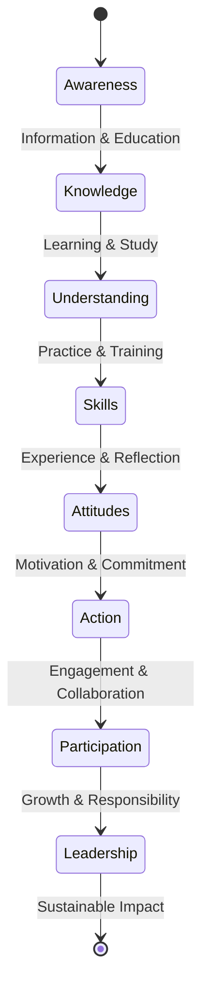

---

### ✏️ Practice Questions

**Short Answer Questions:**
- **Q1.** List the five main goals of environmental education.
  > *Answer: Awareness, Knowledge, Attitudes, Skills, Participation*

- **Q2.** Differentiate between formal and non-formal environmental education.
  > *Answer: Formal education occurs in structured settings like schools with defined curriculum, while non-formal education includes organized programs outside formal system like NGO workshops and media campaigns.*

- **Q3.** Name three government programs for environmental awareness in India.
  > *Answer: National Green Corps, Swachh Bharat Abhiyan, Environment Day Celebrations*

**Long Answer Question:**
- **Q4.** Explain how environmental education progresses from awareness to participation with examples.
  > *Answer: Environmental education starts with awareness (recognizing pollution in local area), develops knowledge (understanding causes of pollution), forms attitudes (caring about clean environment), builds skills (learning to measure air quality), and leads to participation (joining community clean-up drives).*

---

## 📋 Unit I Summary

### 🎯 Key Concepts Recap

**Environment Definition and Components**:
- Environment is the sum total of living (biotic), non-living (abiotic), and human-made (anthropogenic) factors
- Components are interdependent and constantly interacting
- UNESCO defines it as complex of physical, chemical, biological, and social factors

**Types of Environment**:
- **Natural**: Lithosphere, Hydrosphere, Atmosphere, Biosphere
- **Biological**: Flora, Fauna, Microorganisms
- **Social**: Institutions, Culture, Communities
- **Man-made**: Urban areas, Industries, Infrastructure

**Environmental Interrelationships**:
- All components are interconnected through complex relationships
- Changes in one component affect others (domino effect)
- Human activities significantly impact both biotic and abiotic factors
- Examples: Deforestation → Soil erosion → Climate change

**Nature and Scope of Environmental Science**:
- Multidisciplinary field integrating natural and social sciences
- Holistic approach considering environment as complete system
- Problem-solving orientation focused on real-world environmental issues
- Scope includes natural resources, pollution, biodiversity, policy, and sustainability

**Environmental Importance**:
- Life support system providing air, water, food, climate regulation
- Economic foundation supplying raw materials, energy, and resources
- Cultural and aesthetic value with spiritual and recreational significance
- Ecological services like pollination, water purification, waste decomposition

**Case Studies**:
- **Delhi Air Pollution**: Urban environmental crisis with health and economic impacts
- **Chipko Movement**: Successful grassroots forest conservation movement
- **Bhopal Gas Tragedy**: Industrial disaster highlighting need for safety and corporate responsibility

**Environmental Education**:
- Five goals: Awareness, Knowledge, Attitudes, Skills, Participation
- Three types: Formal (school/university), Non-formal (NGO programs), Informal (family/media)
- Indian initiatives: National Green Corps, Swachh Bharat Abhiyan, Environment Day
- Progressive learning from awareness to active environmental participation

```mermaid
mindmap
  root((📚 Unit I Complete))
    🔍 Environment Definition
      Living + Non-living + Human-made
      UNESCO Definition
      Dynamic & Interdependent
    🧩 Components & Types
      Biotic Abiotic Anthropogenic
      Natural Biological Social Man-made
      Four Spheres of Natural Environment
    🔗 Interrelationships
      Component Interactions
      Cause-Effect Chains
      Human-Environment Feedback
    📐 Nature & Scope
      Multidisciplinary Science
      Holistic Problem-solving
      Wide Application Areas
    ⭐ Importance & Cases
      Life Support Economic Cultural
      Delhi Pollution Chipko Bhopal
      Lessons for Sustainability
    🎓 Environmental Education
      Five Progressive Goals
      Formal Non-formal Informal
      Indian Government Programs
```

### 📝 Essential Points for Exams

| Topic | Must Remember | Exam Tips |
|-------|---------------|-----------|
| **Definition** | UNESCO definition, three components | Always mention biotic, abiotic, anthropogenic |
| **Types** | Four types with examples | Remember all four spheres of natural environment |
| **Interrelationships** | Give concrete examples | Use deforestation chain reaction example |
| **Nature & Scope** | Multidisciplinary, holistic approach | List multiple disciplines involved |
| **Case Studies** | Key facts and lessons | Focus on causes, effects, and solutions |
| **Education Goals** | All five goals in sequence | Remember progression from awareness to participation |

---

*This completes Unit I of the Environmental Science Exam Guide. Each section includes theoretical concepts, visual diagrams, and practice questions to ensure comprehensive understanding and exam preparation.*